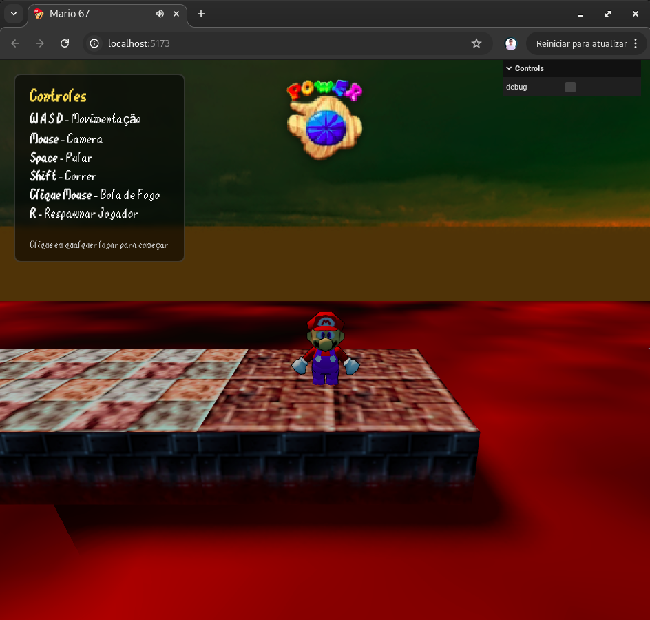
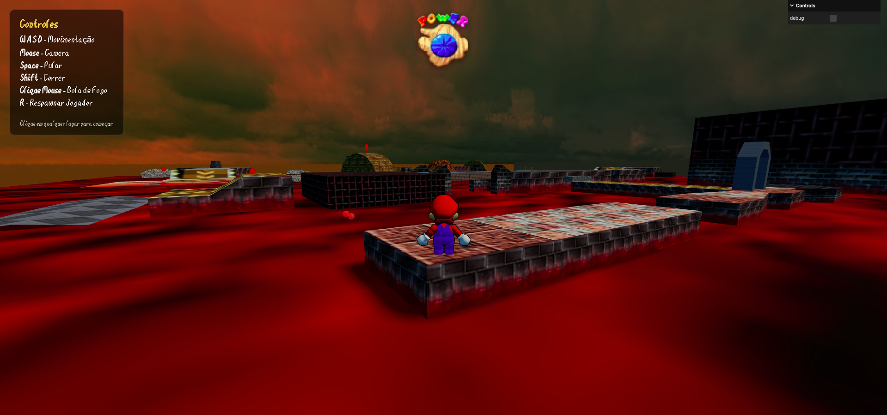
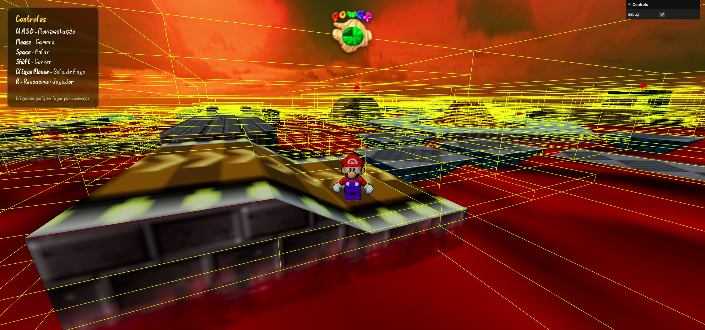
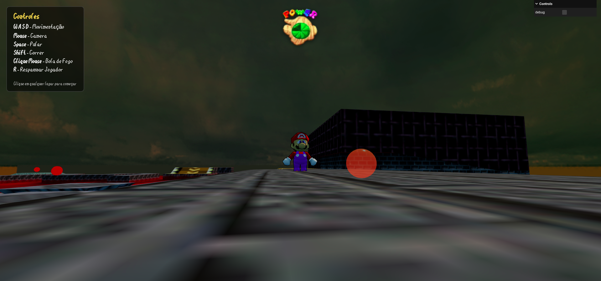
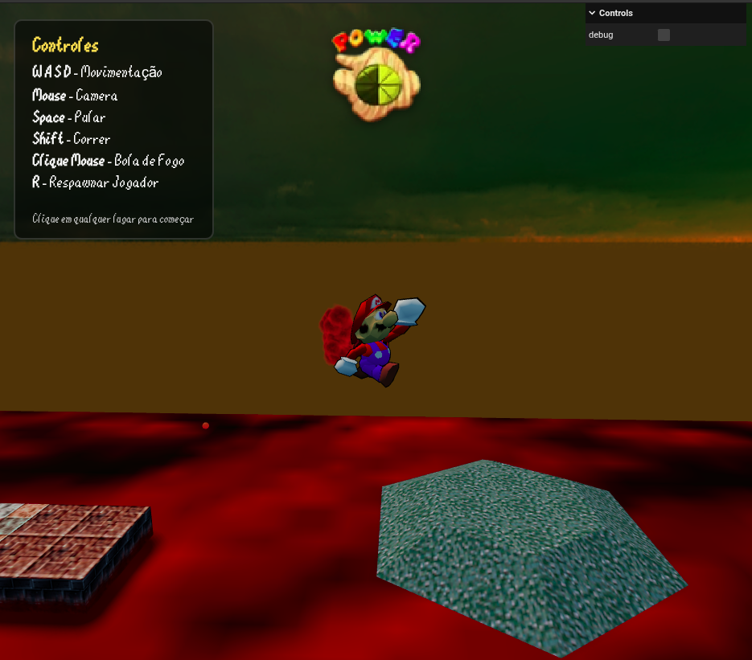
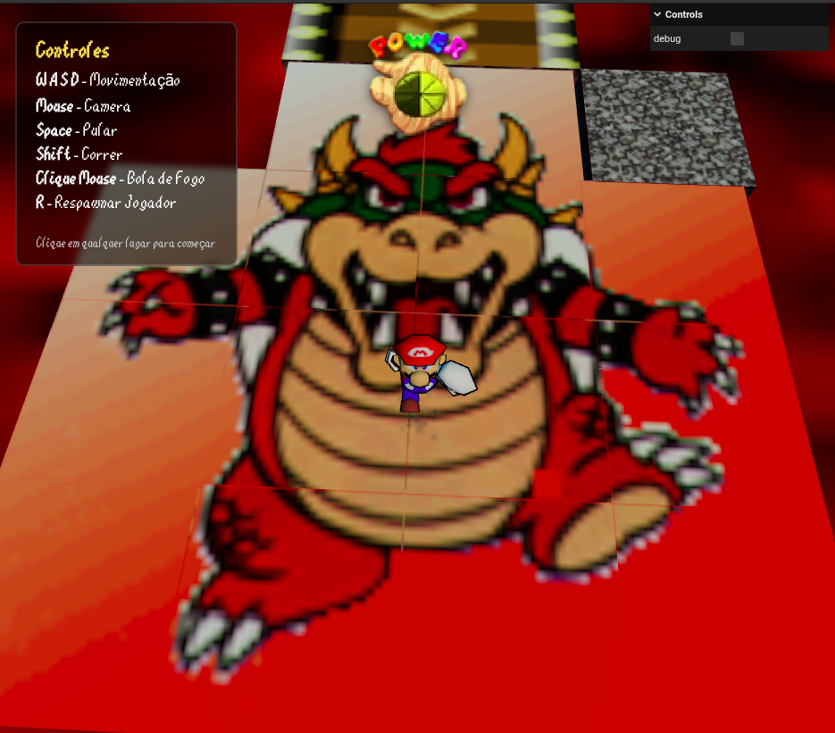

# Mario 64 – Cena 3D Interativa (Atividade 07 – Trabalho Final)


Cena 3D interativa feita com **Three.js**, inspirada no *Super Mario 64*. O
jogador controla o Mario em terceira pessoa por um cenário carregado de um
modelo `.glb`, com física (Rapier + Octree), moedas colecionáveis, lava,
plataformas móveis e sistema de vida.

## Dependências

| Pacote | Uso no projeto |
|---|---|
| [`three`](https://www.npmjs.com/package/three) | Renderização 3D, câmera, luzes, materiais, `Octree`, `Capsule`, `GLTFLoader`, `AudioListener` |
| [`@dimforge/rapier3d-compat`](https://www.npmjs.com/package/@dimforge/rapier3d-compat) | Física do jogador e das plataformas móveis (corpos rígidos, colisores, character controller) |
| [`vite`](https://www.npmjs.com/package/vite) | Servidor de desenvolvimento e build (dev dependency) |
| `cannon-es` | Consta no `package.json` mas **não é usada pois foi derivada de outro projeto** no código atual (pode ser removida com `npm uninstall cannon-es`) |

Requisitos de ambiente:
- **Node.js** 18+ (testado com Node 22)
- **npm** 9+

## Instalação

Dentro da pasta do projeto (`Atividade-07-TrabalhoFinal-Mario_64/`):

```bash
npm install
```

Isso vai instalar `three`, `@dimforge/rapier3d-compat`, `cannon-es` e o `vite`.

## Rodando em modo desenvolvimento

```bash
npm run dev
```

O Vite vai subir um servidor local (por padrão em `http://localhost:5173`).

Abra o link mostrado no terminal em um navegador moderno (Chrome, Edge ou
Firefox recentes, com suporte a WebGL2 e WebAssembly).


## Controles

| Tecla / Ação | Efeito |
|---|---|
| `W A S D` | Movimentação |
| Mouse | Rotaciona a câmera (precisa clicar na tela primeiro para travar o cursor) |
| `Espaço` | Pular |
| `Shift` | Correr |
| Clique do mouse | Atirar bola de fogo |
| `R` | Respawnar o jogador |

## Observações

- O carregamento dos modelos `.glb` usa `DRACOLoader` com decoder carregado
  via CDN do Google (`gstatic.com`); é necessário acesso à internet na
  primeira execução para baixar o decoder.
- Ao clicar na tela pela primeira vez o navegador trava o cursor
  (*Pointer Lock*) e a música de fundo começa a tocar.

## CHECKLIST

| # | Requisito | Pontos | Status |
|---|---|---|---|
| 1 | Plano de fundo (céu) | 2,0 | Feito |
| 2 | Piso e objetos compondo cenário | 2,0 | Feito |
| 3 | Material com textura | 1,0 |  Feito |
| 4 | Material com iluminação | 1,0 | Feito |
| 5 | Objetos com transparência | 1,0 | Feito |
| 6 | Sombras em tempo real | 1,0 | Feito |
| 7 | Diferentes modelos de iluminação | 1,5 | Feito |
| 8 | Movimentação de câmera | 1,0 | Feito |
| 9 | Simulação de física | 3,0 | Feito |

---

## 1. Plano de fundo (céu) — 2,0 pontos

Skybox em cubemap (6 imagens `/skybox/gloomy_*.png`) carregado com
`THREE.CubeTextureLoader` e aplicado como fundo da cena.

- `src/main.js:36-47` — `cubeTextureLoader.load([...])` e
  `scene.background = skybox;`

## 2. Piso e objetos compondo cenário — 2,0 pontos

O cenário (piso, plataformas, decorações) vem de um modelo `.glb`
(`super_mario_64_-_lethal_lava_land.glb`) carregado via `GLTFLoader` e
adicionado à cena. Além dele, o projeto adiciona plataformas móveis e
moedas como objetos extras no cenário.

- `src/main.js:428-469` — carregamento do modelo do nível
  (`loader.load(path3, ...)` → `scene.add(gltf.scene)`)
- `src/MovingPlatform.js:22-37` — plataformas (caixas) adicionadas à cena
- `src/Coin.js:21-41` — moedas coletáveis posicionadas no cenário
  (`src/main.js:194-208`, lista `coinPositions`)

## 3. Material com textura — 1,0 ponto

- `src/main.js:447-449` — as texturas (`material.map`) dos meshes do
  modelo do nível carregado (`anisotropy = 4`)
- `src/ParticleEffect.js:33` — `THREE.TextureLoader().load(...)` para as
  partículas de fumaça/poeira
- Modelos `.glb` do Mario e das moedas (`src/Player.js` / `src/Coin.js`)
  também trazem suas próprias texturas embutidas

## 4. Material com iluminação — 1,0 ponto

Uso de materiais que reagem à luz da cena (em vez de `MeshBasicMaterial`):

- `src/main.js:127-136` — `THREE.MeshPhysicalMaterial` (esferas de fogo)
- `src/MovingPlatform.js:28-32` — `THREE.MeshStandardMaterial`
- `src/Coin.js:76-82` — `THREE.MeshStandardMaterial` (moeda de fallback)
- Materiais originais (PBR) dos modelos `.glb` do cenário e do Mario

## 5. Objetos com transparência — 1,0 ponto

- `src/main.js:131-132` — esferas de fogo com `transparent: true`,
  `opacity: 0.55` e `transmission: 0.15`
- `src/ParticleEffect.js:77-78` e `:152` — partículas de fumaça/poeira com
  opacidade animada (fade-out ao longo da vida da partícula)

## 6. Sombras em tempo real — 1,0 ponto

- `src/main.js:113-114` — `renderer.shadowMap.enabled = true` e
  `THREE.VSMShadowMap`
- `src/main.js:85` e `88-101` — `directionalLight.castShadow = true` +
  configuração da câmera de sombra (near/far, frustum, mapSize, radius,
  bias)
- `src/main.js:143-144` — esferas com `castShadow`/`receiveShadow`
- `src/main.js:444-445` — meshes do cenário com `castShadow`/`receiveShadow`
- `src/MovingPlatform.js:34-35` — plataformas com `castShadow`/`receiveShadow`

## 7. Diferentes modelos de iluminação — 1,5 pontos

Dois tipos de luz combinados na cena:

- `src/main.js:64-74` — `THREE.HemisphereLight` (luz ambiente
  céu/chão, simula luz difusa do ambiente)
- `src/main.js:78-103` — `THREE.DirectionalLight` (luz direcional,
  simula o sol, com sombras)

## 8. Movimentação de câmera — 1,0 ponto

Câmera em terceira pessoa que segue o Mario, controlada pelo mouse
(yaw/pitch);

- `src/Player.js:371-417` — método `updateCamera()`
- `src/Player.js:194-204` — leitura do movimento do mouse
  (`mousemove` → `this.yaw`, `this.pitch`)

## 9. Simulação de física — 3,0 pontos

Duas camadas de física combinadas:

- **Rapier3d** (corpos rígidos): física do jogador (gravidade, pulo,
  colisão) e das plataformas móveis (corpos cinemáticos)
  - `src/main.js:213-220` — `RAPIER.init()` e criação do `RAPIER.World`
  - `src/Player.js:79-94` — corpo rígido dinâmico + collider em cápsula
    do jogador
  - `src/MovingPlatform.js:39-54` — corpo cinemático + collider em caixa
    das plataformas
  - `src/main.js:473` — `world.step()` no loop de animação
- **Física "manual" (Octree + integração de velocidade)**: esferas de
  fogo lançadas pelo jogador, com gravidade, colisão esfera-esfera,
  colisão esfera-jogador e amortecimento
  - `src/main.js:392-426` — `updateSpheres()`
  - `src/main.js:356-390` — `spheresCollisions()`
  - `src/main.js:325-354` — `playerSphereCollision()`
- Outras interações físicas: dano por queda (`Player.js` —
  `checkOutOfBounds`), dano/impulso ao entrar na lava
  (`Player.js` — `checkLava`)

---

## Screenshots

<p align="center">
  
  
</p>
<p align="center">
  
  
</p>
<p align="center">
  
  
</p>